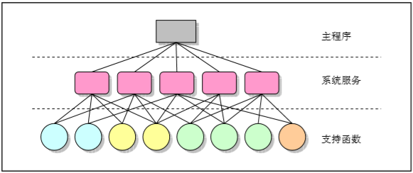
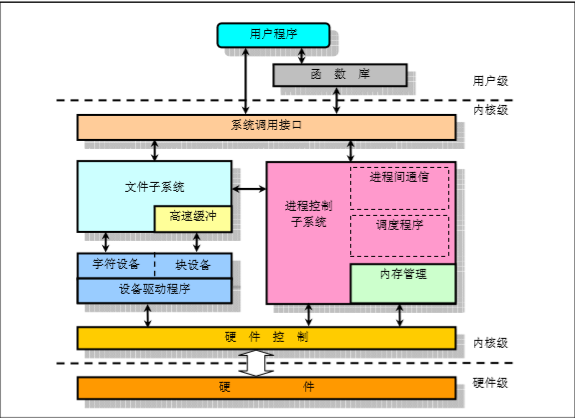

# 第二章  Linux内核体系结构

### Linux内核模式和体系机构

#### 整体式的单内核模式

在单内核模式系统中，操作系统提供服务的流程为：应用主程序使用指定的参数执行系统调用命令，使CPU从用户态（User Mode）切换到核心态（Kernel Mode），然后系统根据参数值调用特定的系统调用服务程序，而这些服务程序则根据需要调用底层的支持函数以完成特定的功能。在完成了应用程序要求的服务后，操作系统又从核心态切换回用户态，回到应用程序中继续执行后续命令。

#### 体系结构

Linux 内核主要由5个模块构成，分别是：进程调度模块，内存管理模块，文件系统模块，进程间通信模块，网络接口模块

### Linux中断机制

中断芯片获得中断请求-->根据优先级将中断号送到CPU-->CPU获得相应的中断向量，执行中断服务程序

对于Linux内核来说，中断分为硬件中断和软件中断（异常）

### Linux系统定时

#### 时钟中断

Linux的OS时钟的物理产生原因是可编程定时/计数器产生的输出脉冲，这个脉冲送入CPU，就可以引发一个中断请求信号，我们就把它叫做时钟中断。

“时钟中断”是特别重要的一个中断，因为整个操作系统的活动都受到它的激励。系统利用时钟中断维持系统时间、促使环境的切换，以保证所有进程共享CPU;

利用时钟中断进行记帐、监督系统工作以及确定未来的调度优先级等工作。可以说，“时钟中断”是整个操作系统的脉搏。

### Linux 内核进程控制

