# 内存管理

80386 通过两步将逻辑地址（即程序员视角的地址）转换成物理地址（即实际内存单元的地址）：

+ 分段地址转换：逻辑地址（包括段选择和段偏移）通过分段地址转换成线性地址
+ 分页地址转换：线性地址通过分页地址转换转换成物理地址（这一步是可选的，根据操作系统的设计需要决定）

地址转换对于应用程序员而言是不可见的，下图提供了对于两种转换的高度抽象。本章的图像提供了对于地址转换机制的一种简化视角。事实上，地址转换机制也包括了**内存保护**的特性。但出于简化目的，关于保护的叙述将在第6章描述。

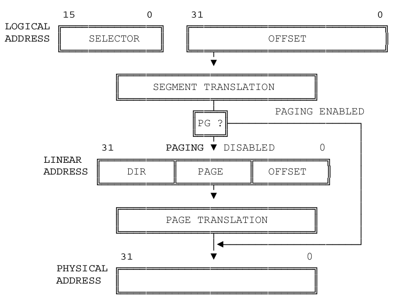

## 分段地址转换

下图描述了关于逻辑地址转换成线性地址的更详细的过程。

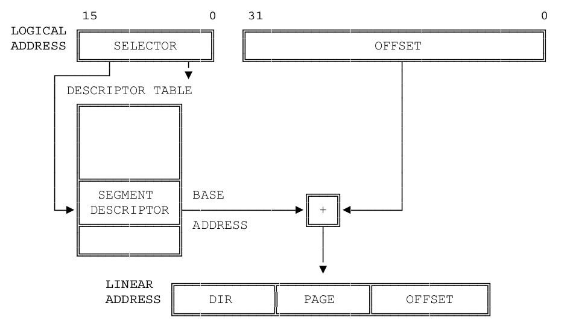

为了实现这种转换，处理器使用了以下数据结构：

+ 段描述符（Desriptors）
+ 段描述符表（Desriptors table）
+ 段选择子（Selectors）
+ 段寄存器（Segment Registers）

### 段描述符

段描述符为处理器提供了将逻辑地址映射到线性地址所需要的数据。段描述符是由编译器，链接器，加载器，或者操作系统生成的，而不是应用程序员生成的。下图描述了两种通用的段描述符格式，所有类型的段描述符都是这二者之一。

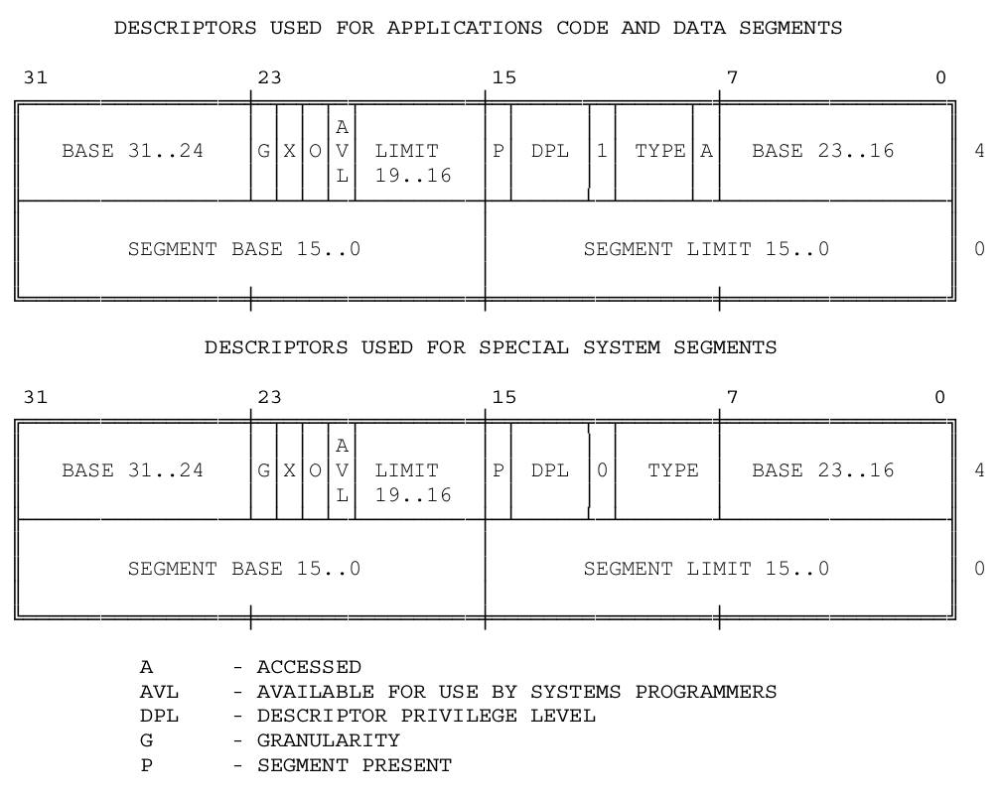

段描述符包括：

+ **段基址(BASE)**:定义了段在4GB的线性地址空间中的位置，处理器将基址的三个部分连接形成一个32位基址。

+ **端界限(LIMIT)**:定义了段的大小，当处理器连接了段界限的两个字段形成了一个20位的段界限值，处理器根据粒度位（granularity byte）的设置情况来以两种方式来解析段界限的值：

  + 当单元大小位1个字节时，20位的界限可表示的范围是1字节到1M字节，增量为1个字节。
  + 当单元大小为4K字节时，20位的界限可表示的范围是4k字节到4G字节，增量为4K字节。则段大小可以高达4G，当界限值在使用之前处理器会将其先左移12位，低位补0。

  **粒度位**：决定了界限值被处理器解析的方式。当它为0时,界限值被解析为以1字节为一个单元。当它为1时,则界限值以4K为一个单元。

+ **类型(TYPE)**:用来区别不同类型的段描述符

+ **描述符特权级( DPL Descriptor Privilege Level)**:用来实现保护机制

+ **段存在位(Segment-Present bit)**:如果这一位为0,则此描述符为非法的,不能被用来实现地址转换。如果一个非法描述符被加载进一个段寄存器,处理器会立即产生异常。下图显示了当存在位为0时,描述符的格式。操作系统可以任意的使用被标识为可用(AVAILABLE)的位。一个实现基于段的虚拟内存的操作系统可以在以下情况下来清除存在位:

  + 当这个段的线性地址空间并没有完全被分页系统映射到物理地址空间时。
  + 当段根本没有在内存里时。

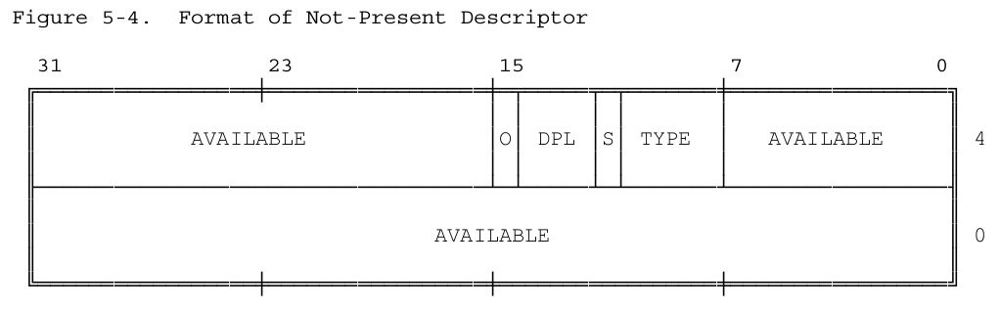

+ **已访问位(Accessed bit)**:当处理器访问该段时,将自动设置访问位。也就是说,当一个指向该段描述符的选择子被加载进一个段寄存器时或者当被一条选择子测试指令使用时。在段级基础上实现虚拟内存的操作系统可能会周期性的测试和清除该位,从而监视一个段的使用情况。

创建和维护描述符是系统软件的任务,一般说来可能是由编译器、程序加载器、系统生成器、或者操作系统来协作完成的。

### 段描述符表

段描述符存储在以下两种描述符表当中的一个:

+ 全局描述符表(GDT)
+ 一个局部描述符表(LDT)

就像下图所示的一样,一个描述符表仅仅是一个包含了很多描述符的8字节内存数组而以。描述符表是长度是可变的,最多可包含高达8192(2^13)个描述符。但是处理器**是不会使用全局描述符表的第一项(INDEX=0)的。**
处理器用GDTR和LDTR来定位内存中的全局描述符表和当前的局部描述符表。这些寄存器存储了这些表的线性地址的基址和段长界限。指令LGDT和SGDT是用以访问全局描述符表寄存器的,而指令LLDT和SLDT则是用来访问局部描述符表寄存器的。

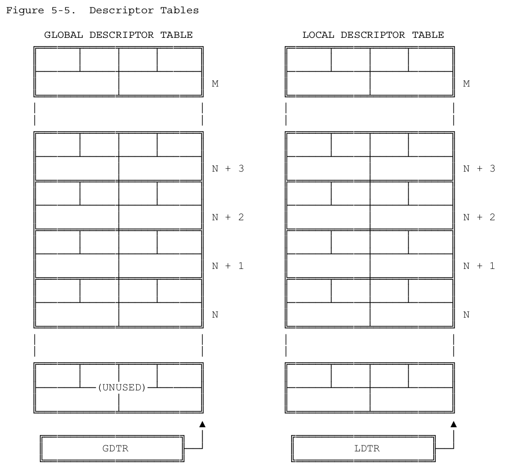

### 选择子
线性地址部分的选择子是用来选择哪个描述符表和在该表中索引一个描述符的。选择子可以做为指针变量的一部分,从而对应用程序员是可见的,但是一般是由连接加载器来设置的。下图显示了选择子的格式。
+ 索引(Index):在描述符表中从8192个描述符中选择一个描述符。处理器自动将这个索引值乘以8(描述符的长度),再加上描述符表的基址来索引描述符表,从而选出一个合适的描述符。
+ 表指示位(Table Indicator):选择应该访问哪一个描述符表。0代表应该访问全局描述符表(GDT),1代表应该访问局部描述符表。
+ 请求特权级(Requested Privilege Level):保护机制使用该位(参看第六章)。

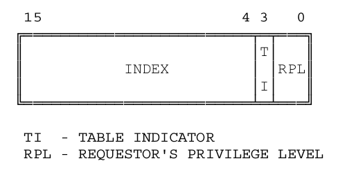

由于全局描述符表的第一项是不被处理器使用的,所以当一个选择子的索引(Index)部分和表指示位(Table Indicator)都为0的时候(也就是说,选择子指向全局描述符表的第一项时),可以当做一个空的选择子。当一个段寄存器被加载一个空选择子时,处理器并不会产生一个异常。但是,当用一个空选择子去访问内存时,则会产生异常。这个特点可以用来初始化不用的段寄存器,以防偶然性的非法访问。

### 段寄存器

80386把描述符的信息存储在段寄存器里,以便不用每次内存访问都去访问内存中的描述符表。如图所示,每一个段寄存器都有一个可见部分和一个不可见部分。这些段寄存器的可见部分被程序员当作一个16位的寄存器来使用。不可见的部分则只能由处理器来操纵。加载这些寄存器的操作和一般的加载指令是一样的(和第三章讲述的相同),这些指令分为两类:

+ 直接的加载指令,例如,MOV,POP,LDS,LSS,LGS,LFS。这些指令显示的访问这些段寄存器。
+ 隐式的加载指令,例如,CALL和JMP。这些指令隐式的访问CS段寄存器,将它加载一个新的值。

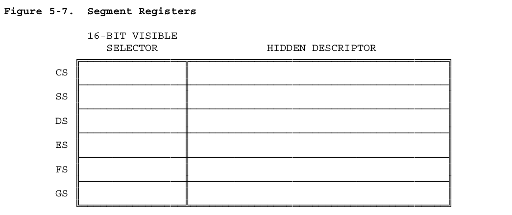

使用这些指令,程序将用一个16位的选择子加载段寄存器的可见部分。处理器将自动的将基址、界限、类型、和其它信息从描述符表中加载到段选择子的不可见部分。

因为很多数据访问的指令都是访问一个已加载段寄存器的数据段,所以处理器可以用与段相关的基址部分加上指令提供的偏移部分,而且不会有额处的加法开销。

## 分页地址转换

在地址转换的第二个阶段,80386将线性地址转换为实物理地址。这个阶段实现了基于页的虚拟内存和页级保护机制。
分页地址转换过程是可选的。只有当CR0中的PG位置位时才会产生效果。这个位的设置一般来说是由操作系统在系统初始化的过程中设置的。如果操作系统想要实现能运行多个虚拟8086任务、基于页级的保护、基于页级的虚拟内存的话,PG位是必需置位的。

### 页帧

一个页桢是一个地址连续的4K大小单元内存。各页以字节边界为起始,大小固定不变。

### 线性地址

一个线性地址间接的访问到一个实物理地址。它通过使用一个页表,表内的一个页,和一个页内的偏移来映射到实物理地址。

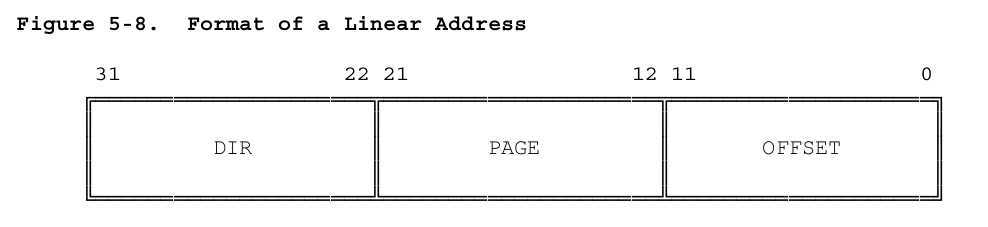

图5-9显示了处理器如何将线性地址中的DIR,PAGE,和OFFSET字段转换为实物理地址上的,这个过程使用了两级页表。寻址机制使用DIR字段来索引页目录表,用PAGE字段来索引页表,这样就可以确定一个物理页桢了,然后再使用OFFSET部分来索引该物理页桢,最终访问所需要的数据。

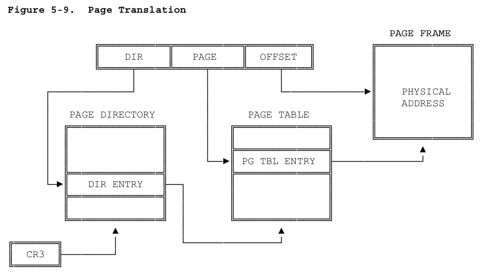

### 页表

一个页表仅仅是很多32-位页指示器(32-bit	page specifiers)组成的一个数组。页表本身也是一个页,所以包含了4K字节内存空量(最多可包含1K个32-位的表项)。

在寻址一个内存页时,使用了两级的页表。高一级的页表也被叫作页目录。页目录可最多寻址1K个二级页表。一个二级页表最多可寻址1K个页面。所以,一个页目录最多可寻址1M个页面。因为每个页面有4K(2^12)字节大小。所以一个页目录可寻址整个80386的实物理地址空间(2^20 * 2^12	= 2^32)。

### 页表项

两级页表项都有相同的格式，图5-10显示了这种格式。

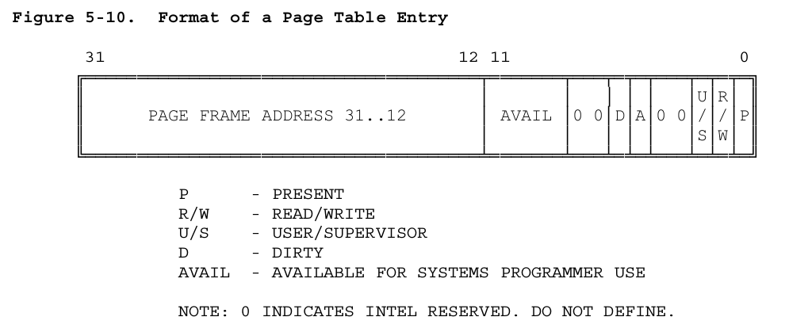

+ 页桢地址

页桢地址指出了一个实物理页的开始地址。因为页的地址是以4K为边界的，所以地址的低12位总是为0。在页目录中，页桢地址是二级页表的起始地址。在二级页表中，页桢地址是所要要访问的物理页的起始地址，该物理页包含了要访问的指令操作数。

+ 存在位（Present Bit）

存在位决定了一个页表项是否可以用作地址转换过程，如果P=1则可以用该页表项。

当任何一级页表项的P=0时，该项都不可以用作地址转换过程，这时，该项的其它位可以被软件使用。它们中的任何一位都不会被硬件使用。图5-11显示了当P=0时的页表项格式。

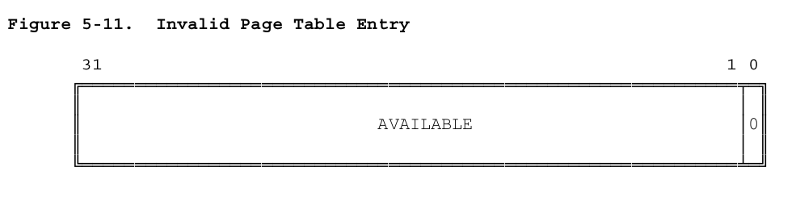

当任何一级页表项的P=0时，而软件又试图用它来访问内存时，处理器将会引发一个异常。在支持页级虚拟内存的软件系里，缺页异常处理子程序可以将所需的页面调入物理内存。引起缺页异常的指令是可以重起的，关于异常处理的更多信息请参看第9章。

注意，没有页目录自身的存在位。当任务挂起时，该任务的页目录是可以不存在的，但是操作系必须在一个任务被重运行前确保该任务的CR3映象（保存在TSS里）指示的页面（即页目录表）在内存中。关于TSS和任务指派的详细信息请参看第7章。

+ 已访问位和脏位（Accessed and Dirty Bits）

这些位提供了两级页表的数据使用情况信息。除了页目录表的脏位（Dirty bit），所有的这些位都由硬件自动置位，但是处理器绝对不会复位它们。

在一个页面被读或写之前，处理器将自动将两级页表的这些相关的位置1。

当向一个地址写入时，处理器将会把相关的二级页表的脏位（Dirty bit）置为1。页目录表项的脏位没有作定义。

当系统内存紧张时，一个支持页级虚拟内存的操作系统可以使用这些位来决定将要换出哪些物理页面。操作系统应该自已负责测试和清除这些相关位。

参看第11章，学习80386如何在多处理器环境下更改访问位和脏位。

+ 读/写 位，用户/特权用户 位（Read / Write and User / Supervisor Bits）

这些位并不是用于地址转换过程的，它们是用来实现页级保护机制的，这些保护机制是在地址转换过程的同时实施的。参看第六章，以了解理多关于保拟机制特性。

### 页地址转换缓存

为了获得最大的地址转换效率，处理器把最近使用的页表数据存储在一个芯片内的缓存中。只有当所要的地址转换信息没有在缓存中时，才有访问两级页表的必要。

应用程序员是感觉不到页地址转换缓存的存在的，但系统程序员知来说不是。当页表内容改变时，操作系统程序员必须清除缓存。页地址转换缓存可以用以下两种方法清除：

+ 通过MOV 指令重新加载CR3寄存器，例如，MOV CR3， EAX。
+ 通过任务切换到一个TSS，该TSS保存了一个不同的CR3映象。关于任务切换，请查看第7章。

## 混合分段和分页地址转换

图5-12 结合了图5-2和图5-9来对两阶段（从逻辑地址到线性，再从线性地址到实物理地址（当启用分页时））的地址转换做一个总结。通过使用不同的方法，内存管理软件可以实现几种不同形式的内存管理机制。

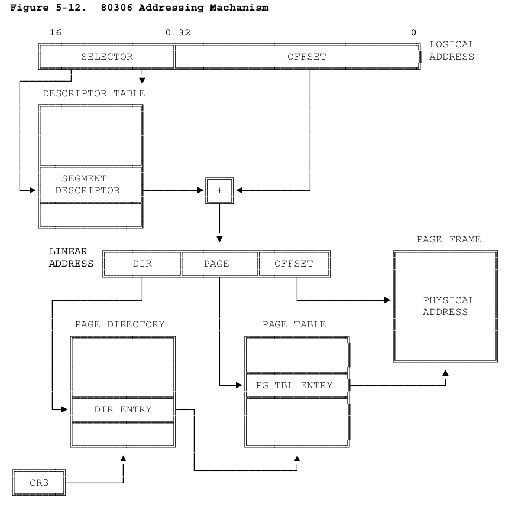

### 平坦体系结构

当80386用来执行一些程序，而这些程序也为别的不支持分段的处理器而设计时，有效的“关闭”分段可能比较好。80386没有禁止分段的执行模式，但是同样的效果是可以通过一些特定的方法实现的：把指向包括整个32-位地址空间的描述符的选择子加载到段寄存器里，段选择子没有必要改变。32-位的偏移已足够寻址整个80386支持的内存空间了。

### 跨多个页的段

80386系统结构允许一个段比内存页（4K）大，也允许比内存页小。比如，有一个段用来寻址和保护一个大小为132K的数据结构。在一个支持页级虚拟内存的软件系统里，没有必要把这一整个段都调入实物理内存。该结构被分成功33个页面，任何一个都可以不存在。应用程序员不会感觉到虚拟内存系统在以这种方式调动页面。

### 跨段的页面

在另一方面，段可能比一个页面要小。比如，考虑一个数据结构（如信号量（Semaphore））。因为段的保护和共享机制，把每一个信号量放在一个段里也许比较好些。但是，由于一个系需要很多的信号量，如果为每一个信号量分配一页的话效率很低下。所以，把几个段合并到一个页面里应该更好。

### 非对齐的页和段边界

80386系统并不强求页和段的任何对齐。即使一个页包含了一个段的结尾又包含了一个段的开始也是完全可以的。类似的，即包含一个页的开始和另一个页的结尾的段也是完全允许的。

### 对齐的页和段边界

如果页与段之间有一定的对齐的话，对于内存管理系统来说也许会简单很多。例如，如果一个段只以页为单元来分配的话，段页逻辑将会结合起来。就没有为部分页面而管理的逻辑了。

### 每段一个页表

一个更简单的内存空间管理方法便是将每一个段对应为一个页目录项，图5-13显示了这种方式。每个描述符的基址部分的低22位都将是0。换言之，基址被映射到每个页表的第一项。每个段长度可以从1到4M的任意大小。一个段可以包含1到1K个物理内存页，多少则由长度界限字段来决定。这样的话，一个任务可以寻址1K个段（对于很多应用程序来说都足够了），每个段可以高达4M字节。描述符，和与之对应的页目录项，还有与之对应的页表，就可以同时分配同时回收。

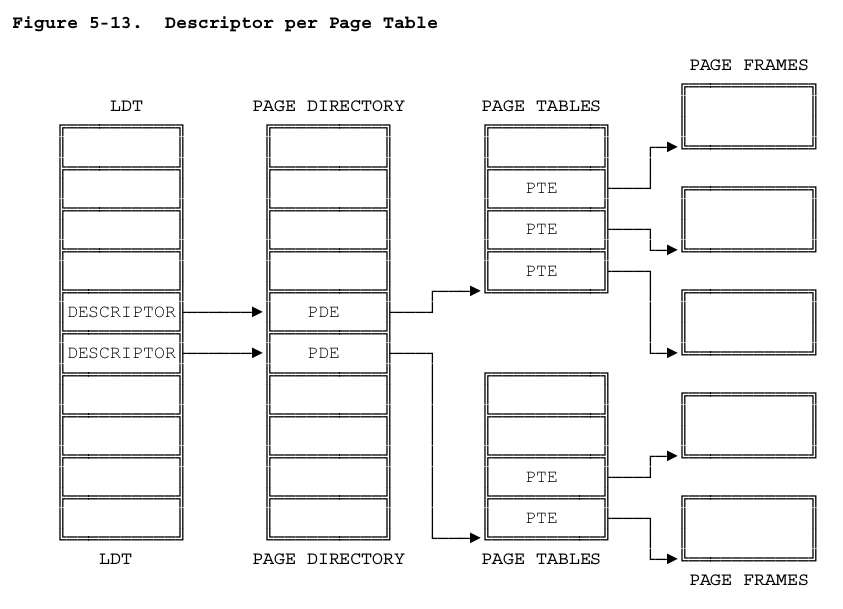