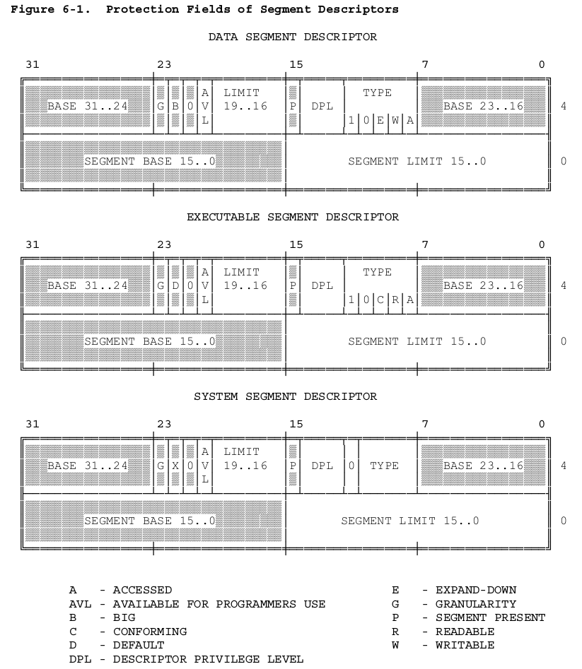
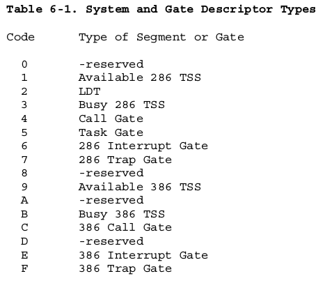
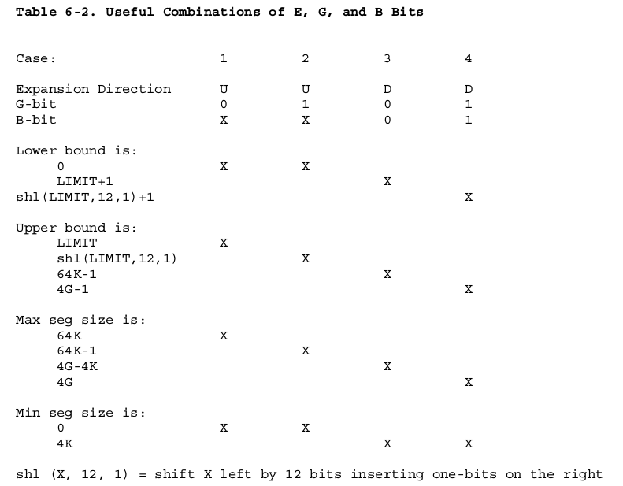
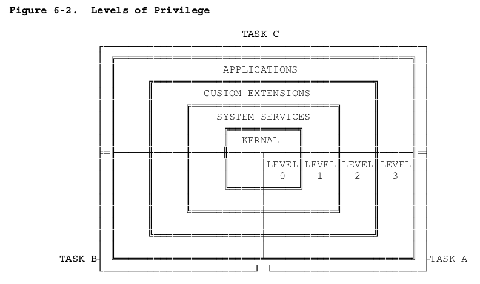
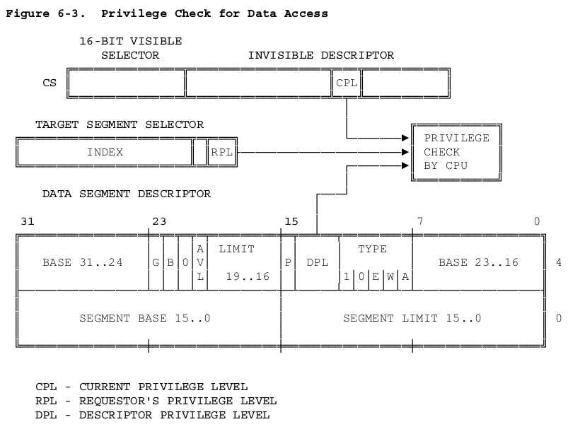
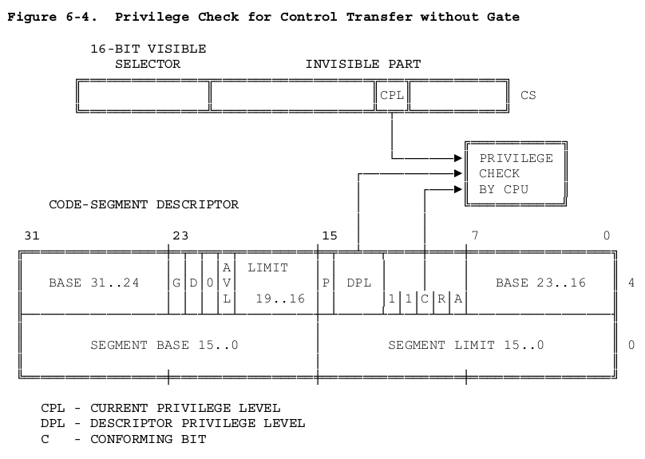

# 保护

80386保护机制有助于找出和调试程序的BUG。80386支持很复杂的程序，它们可以包含成百上千的程序模块。在这样的程序中，关键问题是如何快而有效的找出程序的BUG，并将之造成的损坏降到最小。为了能让程序便于调试和生成高质量的产品，80386包含了检验内存访问、指令执行等很多保护机制。根据系统设计者的设计目标，这些保护机制可以使用，也可以忽略。

## 保护机制概述

80386 保护机制主要包括以下5个方面:

+ 类型检查(Type Checking)
+ 界限检查(Limit Checking)
+ 寻址范围约束(Restriction of addressable domain)
+ 子程序入口点约束(Restriction of procedure entry points)
+ 指令集约束(Restriction of instruction set)

内存管理硬件也被集成到了80386的硬件保护机制当中。保护机制同时施于分段地址转换过程和分页地址转换过程。

每一次的内存访问都将被检查，以保证没有违反保护机制。所有这些检测都是在内存访问周期之前执行的。所有的违规行为都将引发异常。因为检测是与地址转换同时进行的，所以并没有性能上的损失。

非法的内存访问将引发异常。关于异常更多的信息，请查阅第9章。这一章只介绍引发异常的非法操作。

“特权级”（”privilege”）的概念是很多保护机制的核心。对于子程序，特权级是指一个子程序被信赖的程度，这种信赖程度可以使别的子程序或数据免受损害。对于数据，特权级是指对数据结构的保护程度，这种程度可以让该数据结构免受不信任代码的访问。

特权级的概念对分段机制和分页机机制同时有效。

## 段级保护

段保护机制有以下五个方面：

1. 类型检查（Type Checking）
2. 界限检查（Limit Checking）
3. 寻址范围约束（Restriction of addressable domain）
4. 子程序入口点约束（Restriction of procedure entry points）
5. 指令集约束（Restriction of instruction set）

段是保护的单元，段描述符用来存储保护机制参数。当把一个选择子加载进段描述符时和每次段访问时CPU自动执行保护检查。段选择寄存器保存着当前可寻址段的保护机制参数。

### 描述符存储保护机制

图6-1高亮显示了段描述符中与保护相关的字段。

在描述符创造时，操作系统同时把保护参数入在描述符中。一般来说，应用程序员不用关心保护参数的。

当程序把一个选择子装入段寄存器时，处理器不仅加载段的基址部分，而且也把保护参数装入段寄存器。每个段寄存器有一个不可见的部分用来存放基址、界限、类型、和特权级。所以对于以后的保护检查，处理器不必浪费多于的时钟周期去从内存中加载这些信息。

#### 类型检查

段描述符的类型字段有两个作用：

+ 用于区分不同类型的描述符
+ 指示了一个段的用途

除了被应用程序广范使用的数据段和可执行段描述符外，80386还有特殊的描述符，用来描述和操作系统相关的段（Segment）和门（Gate）。图6-1列出了所有类型的系统段和门。注意，不是所有的描述符都定义了一个段。门描述符有不同的用法，将在第7章描述。

数据段和可执行段的类型字段包括了以下这些位，用来定义一个段的用途（参看图6-1）：

- 在一个数据段描述符中，可写位指出了指令是否有权向这个段写入数据。
- 在一个可执行段描述符中，可读位指出了指令是否有权从这个段中读出数据（例如，用来访问与指令一起储存的常量数据）。可读的可执行段可以在以下两种方式下读取：
  + 通过使用CS前缀，来访问CS 寄存器指定的段。
  + 把描述符加载到数据段寄存器（DS，ES， FS， GS）。

类型检查可以检测出某些程序错误，比如，当程序员访问一个不是为某种目的设定的段时。处理器在以下两种情况下检查类型：

1. 当把一个描述符加载到一个段寄存器时。有些段寄存器只能加载某些类型的描述符，比如：
   + CS 寄存器只能加载一个可执行段的描述符。
   + 只有可执行的数据段描述符才能加载入SS段寄存器。

2. 当一条指令访问一个段时（显式的或者隐式的）。一些段只能通过一些特定的方式才能使用，例如：
   + 可执行段不允许任何指令写入数据。
   + 如果一个数据段的可写位没有置位，任何指令不可向其写入数据。
   + 如果一个可执行段的可读位没有置位，任何指令不可从该段读取数据。

#### 界限检查

一个描述符的界限字段是用来防止程序在访问一个段时超出段的范围的。处理器根据描述符的G位（granularity bit）来解析界限字段的。对于数据段，处理器在解析界限字段时还要根据E位（expansion-direction bit）和 B位（big bit）（参看表6-2）。

当G=0 时，界限字段的值即是描述符中20位的 limit-field。这时，界限可能从0~0FFFFF （2^20 – 1 或者说 1 M）。当G=1时，处理器将会自动的在描述符的 limit-field 低位加12位0。这样，实际的界限值可以从0FFFH（2^12 – 1 或者说4K）到0FFFFFFFFH（2 ^ 32 – 1 或者说4G）。

除了向下延伸的段外，界限值总比段的大小少1（字节表示）。当以下任一情况发生时，处理器引发异常：

- 试图访问一个 地址 > 界限 的字节。
- 试图访问一个 地址 >= 界限 的字。
- 试图访问一个 地址 >= （界限 – 2 ） 的字双字。

对于向下延伸的数据段，界限作用相同，但是被处理器以不同的方式来解析。这个时候，有效地址则从 limit + 1 到 64K 或者 2^32 – 1（4G）(由B位决定)。向下延伸的段当界限设为0时，有最大的段长。

向下延伸的特性允许把堆栈拷贝到一个更大的段，而不改变内部段指针，来增大一个堆栈的大小。

描述符表的界限字段用来防止程序寻址超出一个描述符表。界限用来确定描述符表的最后一个描述符的最后一个字节。因为一个描述符是8字节长，界限字段的值为

N * 8 – 1 ,对于一个包含N个描述符的描述符表。

界限字段可以查测到类似下标出界和非法指针运算等程序错误。这些错误一当发生时就可以被发现，所以确定这种错误是很简单的。如果没有界限检查，这些的错误会使一个模块受到破坏，这种错误只有当下一次受损的模块不正常工作时才会被发现，而且发现也是比效困难的。

#### 特权级

处理器通过赋给一个重要的对象以一个 0 ~ 3 的数字来实现特权级。这个数字被称为特权级。0代表最高特权级，3代表最低特权级。以下的对象包含了特权级：

- 描述符包含了一个叫做描述符特权级（DPL）的字段。
- 选择子包含了一个叫做请求特权级（RPL）的字段。RPL 代表着指向子程序的选择子。
- 处理器的一个内部寄存器记录了一个叫做当前特权级（CPL）的字段。一般来说，CPL 和当前正在执行的代码段的DPL是相同的。当控制在不同特权级的段间转移时，CPL发生变化。

当某个段的一个子程序要访问一个段时，处理器会自动的把一个要访问某个段的子程序的特权级和CPL或者更多的特权级相比。这种比较是在当一个描述符被加载到一个段寄存器时执行的。比较的标准在访问数据时和控制转移时是分别不同的。所以，就有了以下两种不同的查测：

图6-2显示了不同特权级环的解析方式。中心是用来放最关键的软件的，一般来说是操作系统内核。外面是用来放次关键的应用软件段的。

4个特权级全用并不是必要的。已存在的软件如果是主两级特权级设计的，也可以很好的被80386支持的。一个只用一级特权级的系统应该使用特权级0；一个使用两级特权级的系统应该使用特权级0和特权级3。

### 访问数据约束

为了寻址一个操作数，80386必须把一个选择子加载到一个段寄存器（DS， ES， FS， GS， SS）里。处理器自动执行访问特权级的检查。检查是在当选择子被加载入段寄存器时执行的。图6-3显示了，在这种检测下的3种不同的特权级。

1、 CPL（当前特权级（current privilege level））

2、 用来指定目标段的选择子的RPL（请求特权级（requestor’s privilege level））。

3、 目标段的DPL（描述符特权级）

一条指令只有当一个目标段的DPL在数值上大于或等于CPL和选择子的RPL中的最大值时，才可以加载目标段的选择子到一个段寄存器里。也就是说，一个子程只能访问它同级的或比它特权级低的数据。

当一个任务的CPL改变时，它的可寻址范围也会改变。当CPL是0时，任何特权级的数据段都是可寻址的。当CPL是1时，只有特权级从1 ~ 3 的数据段才是可寻址的，当CPL是3时，只有特权级是3 的数据段才是可寻址的。80386的这个性质可以保护操作系的内部表不被应用程序所读取或更改。

#### 在代码段中访问数据

更少见点的情况可能是在一个代码段内存储数据。代码段可以存储常量。任何指令不能向一个代码段写入数据。以下是可以在代码段内访问数据的方法：

1、 用一个非一致性的、可读的、可执行的选择子加载一个数据段寄存器。

2、 用一个一致性的、可读的、可执行的选择子加载一个数据段寄存器。

3、 用CS前缀来读取一个可读的，可执行的代码段（该段当前已被CS寄存器所指向）。

在访问数据时，和正常的数据访问规则适用于第1种情况。情况2总是合法的，一致性段的特权级总是和当前特权级（CPL）相同，无论该段的DPL是多少。第三种情况也是合法的，因为目标段的DPL就是代码段的DPL，根据定义，也就是CPL。

### 控制转移约束

在80386中，控制转移是通过指令 ``JMP, CALL, RET, INT, 和 IRET ``当然还有异常和中断机制。异常和中断是特殊的情况，在第9章中讲述。这一章讲述JMP，CALL，和RET 指令。

``JMP, CALL, RET`` 指令的“NEAR”（近）形式，只在当前的代码段内发生转移，所以**安全检查只涉及到界限检查**。处理器保证``JMP， CALL， RET``指令不会超出当前执行的代码段的限长。这个限长被存储在CS段寄存器的不可见部分。所以这种检查不会带来额外的时钟周期。

而``JMP， CALL， RET ``的“FAR”（远）形式则会转移到不同的段内，所以，处理器将执行特权级检查。``JMP``和``CALL``有两种方法转移到另一个段：

+ 操作数选择一个另一个可执行段的描述符。

+ 操作数选择了一个调用门描述符。这种门形式的转移将在下一节介绍调用门时讲述。

图6-4显示了，两种不同特权级之间的控制转移（没有使用调用门时）：

+ CPL（当前特权级（Current privilege level）
+ 目标段的描述符的DPL

一般来说，CPL和处理器正在执行的段的DPL是相同的。但是，当正在执行的段的一致性位（conforming bit）置位时，CPL也可能比DPL要大。处理器把当前特权级（CPL）缓存在CS段寄存器里，这个值也可能和当前代码段的描述符特权级不同的。

只有当以下条件致少满足一个时，处理器才允许JMP或CALL直接转移到另一个段：

- 目标段的DPL和CPL相同时。
- 目标代码段的一致性位（conforming bit）设置时，而且目标代码段的DPL与CPL相等或者目标代码段的DPL比CPL小。

一致性位设置的段被称为一致性段。一致性段的机制允许不同特权级共享子程序，而且在执行其中的子程序时使用自已的特权级，而不是使用一致性段的段描述符特权级。一个例子就是数学库子程序和一些异常处理子程序。当控制转称到一致性段时，CPL不会改变。这就是唯一的CPL不等于当前可执行代码段的情况。

许多代码都是非一致性的（non-conforming）。上述的基本特权级检查意思是，对于非一致性段，不通过门描述符可以转移到一个相同特权级的可执行段。但是，有时我们也需要从低特权级向高特权级（数值上比较小的）转移。这种需要就可以能过调用门（call-gate）来实现。调用门在下一节中介绍。JMP 指令不可能通过任何方法转移到DPL与CPL不同的非一致性段中去。