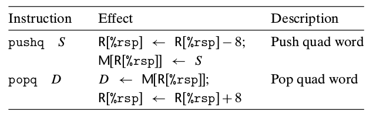
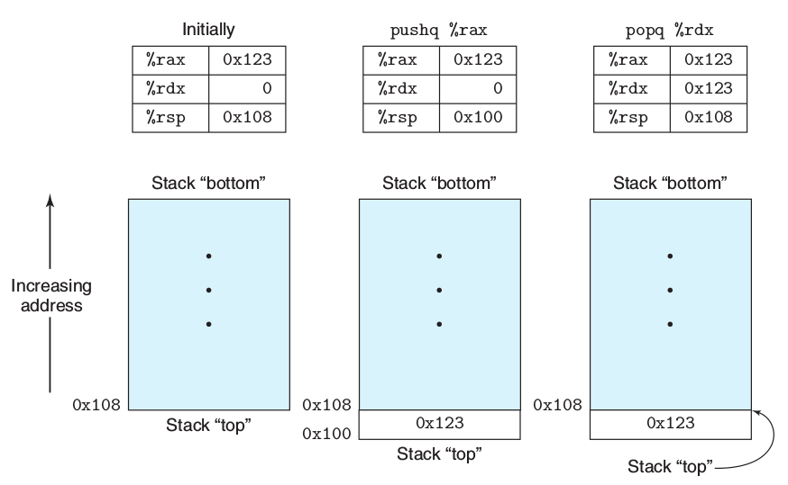
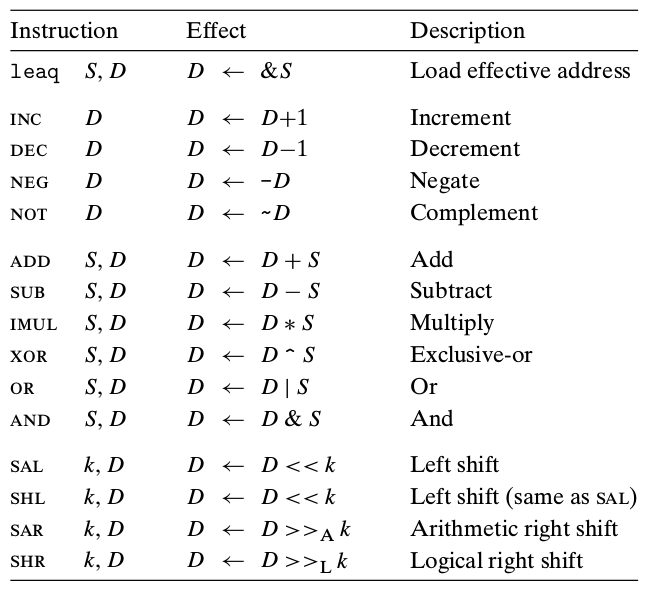
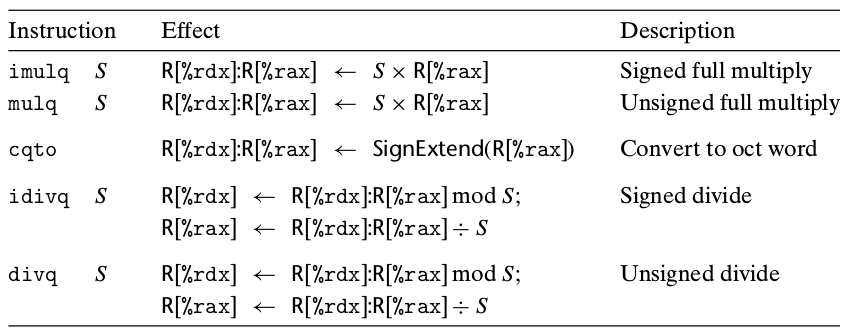
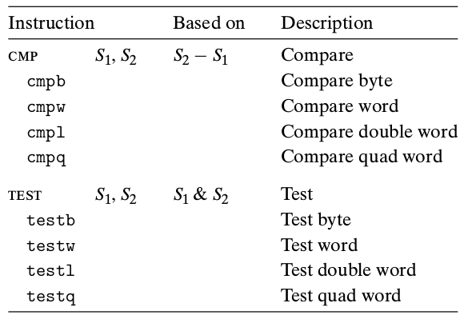
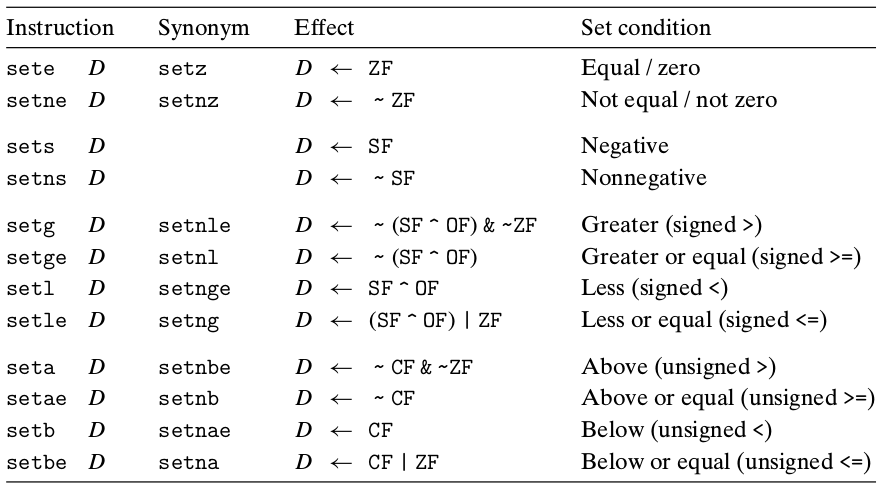

## AT&T 汇编(x86_64)

### 数据格式

| C声明  | Intel数据类型     | 汇编代码后缀 | 大小（字节） |
| ------ | ----------------- | ------------ | ------------ |
| char   | 字节              | b            | 1            |
| short  | 字                | w            | 2            |
| int    | 双字              | l            | 4            |
| long   | 四字 (quad words) | q            | 8            |
| char * | 四字              | q            | 8            |
| float  | 单精度            | s            | 4            |
| double | 双精度            | l            | 8            |

**注意**：汇编代码也使用后缀`l`来表示四字节整数和8字节双精度浮点数。这不会产生歧义，因为浮点数使用的是一组完全不同的指令和寄存器。

### 访问信息

寄存器信息


寄存器仍然向前兼容，即仍有例如`ax，ah，al`的寄存器访问方式。

### 操作数指示符

大多数指令都有一个或多个操作数。指示执行一个操作中要使用的源数据值，以及放置结果的目的位置。

#### 操作数类型

+ 立即数(immediate)
+ 寄存器(register)
+ 内存引用

#### 寻址模式


> $Imm 表示立即数
>
> M[Imm]表示直接寻址
>
> R[ra] 表示寄存器直接寻址
>
> M[R[ra]] 表示寄存器间接寻址
>
> 剩下的形式即为各种**变址寻址**的方式

### 数据传送指令

MOV类指令

**传送指令的两个操作数不能都指向内存位置**,将一个值从一个内存位置复制到另一个内存位置需要两条指令，即先复制到寄存器，再从寄存器复制到内存。

#### 简单的数据传送指令


#### 零扩展数据传送指令


#### 符号扩展数据传送指令


`movl`指令以寄存器为目的时，**会把该寄存器的高位四字节设置为0**，因此所有源类型都有对应的符号扩展，而只有较小的两种源类型有零扩展传送

`ctlq`指令没有操作数，它总是以寄存器`%eax`作为源，`%rax`作为符号扩展结果的目的。

#### 压入和弹出栈数据

栈在处理过程调用中起到至关作用的作用。`%rsp`表示栈顶指针寄存器



如图所示，栈向下生长，既栈顶元素的地址是所有栈中元素地址最低的，根据惯例，内存的示意图低地址在下，高地址在上。



**入栈**:首先栈顶地址减8(即操作字长)，然后将值写到新的栈顶地址。

**出栈**:先将值写出，在将栈顶地址加8(操作数字长)

### 算数和逻辑操作

常见的算数和逻辑操作



#### 加载有效地址

`加载有效地址`(load effective address)指令leaq实际上是movq指令的变形。它的指令形式是从内存读数据到寄存器，但实际上他根本就没有引用内存。他的第一个操作数看上去是一个内存引用，但实际上，该指令并不是从指定的位置读取数据，而是**将有效地址写入到目的操作数**。

#### 一元和二元操作

第二组中的操作是一元操作，只有一个操作符，既是源又是目的，操作数可以是寄存器也可以是一个内存位置，比如``inc``指令实现类似C语言中的自加操作。

第三组是二元操作，**第二个操作数既是源又是目的**，这种操作类似C语言中的赋值操作，第一个操作数可以时内存位置，立即数，寄存器，第二个操作数可以是寄存器或者内存位置。当第二个数是内存位置时，处理器必须从内存读出值，执行操作，再把结果写回内存。

#### 移位操作

最后一组是移位操作，先给出移位量，然后第二位给出得是要移位的数。可以进行算数和逻辑移位。移位量可以是一个立即数，或者放在单字节寄存器``%cl``中（这些指令只允许这个特别的寄存器作为操作数）原则上来说，1个字节的移位量的编码范围可以达到255，实际上，**在X86_64中，移位操作对于``w``位字长的数据值进行操作，是根据``%cl``寄存器的低m位决定的，这里``2^m=w``,高位会被忽略**。例如当``%cl``寄存中的十六进制值为``0xFF``时，指令`salb`会移7位，``salw``会移15位，``sall``会移31位，而``salq``会移63位。

#### 特殊的算数操作



Intel对64位乘法扩展成128位的指令集，暂不了解

### 控制

机器代码提供两种基本的低级机制来实现有条件的行为：测试数据值，然后根据测试的结果改变控制流或者数据流。

#### 条件码

CPU维护这一组单个位的条件码(condition code)寄存器，描述了最近的算数或逻辑操作的属性，可以检测这些寄存器来执行条件分支指令。常用条件码如下：

+ CF:进位标志(无符号数的溢出)
+ ZF:零标志
+ SF:符号标志
+ OF:溢出标志(补码溢出)

设置条件码的常用指令如下：



#### 访问条件码

条件码通常不直接读取，常用的使用方法有三种

1. 根据条件码的某种组合，将一个字节设置成０或１
2. 条件跳转到程序的某个其他的部分
3. 有条件的传送数据

对于第一种情况，有一类``set``指令，可以根据条件码的某种组合，将一个字节设置成０或１。这些指令的后缀指代的是不同的条件而不是和通常一样指示操作数大小。如下图



一条``set``指令的目的操作数是低位单字节寄存器，或是一个字节的内存位置，指令会将这个字节设置成０或者１。为了得到一个32位或64位结果，需要对高位清零。

#### 跳转指令

正常情况下，指令按照顺序逐条执行，跳转（``jmp``）指令会导致执行切换到程序中的一个全新位置，在汇编代码中，跳转的目的地通常用一个标准``label``指明。


``jmp``指令是无条件跳转。在汇编语言中，直接跳转使用一个标号``label``指出，而简介跳转使用一个``*``后面跟一个操作数提示符，例如：

```x86asm
jmp *%rax
以寄存器值作为跳转目标
jmp *(%rax)
以寄存器值读内存，从内存中读出跳转目标
```

表中其他均为有条件跳转，这些条件跳转名字和set指令是相匹配的。**条件跳转只能是直接跳转**。