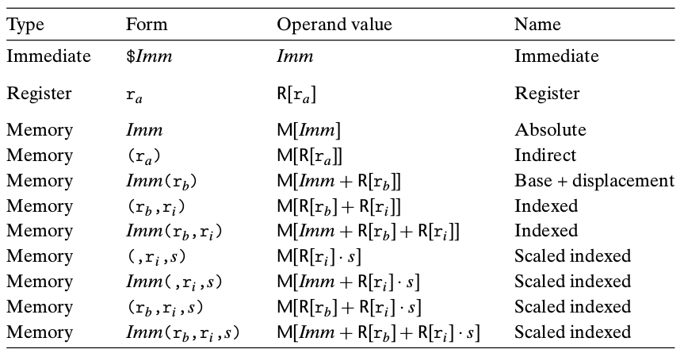
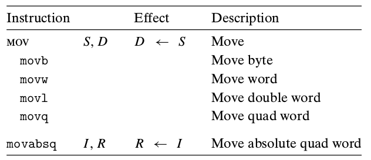
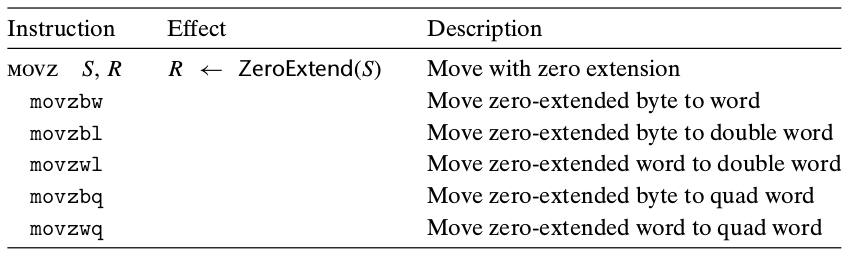
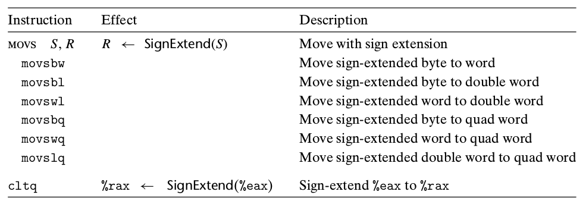

## AT&T 汇编(x86_64)

### 数据格式

| C声明  | Intel数据类型     | 汇编代码后缀 | 大小（字节） |
| ------ | ----------------- | ------------ | ------------ |
| char   | 字节              | b            | 1            |
| short  | 字                | w            | 2            |
| int    | 双字              | l            | 4            |
| long   | 四字 (quad words) | q            | 8            |
| char * | 四字              | q            | 8            |
| float  | 单精度            | s            | 4            |
| double | 双精度            | l            | 8            |

**注意**：汇编代码也使用后缀`l`来表示四字节整数和8字节双精度浮点数。这不会产生歧义，因为浮点数使用的是一组完全不同的指令和寄存器。

### 访问信息

寄存器信息

寄存器仍然向前兼容，即仍有例如`ax，ah，al`的寄存器访问方式。

### 操作数指示符

大多数指令都有一个或多个操作数。指示执行一个操作中要使用的源数据值，以及放置结果的目的位置。

#### 操作数类型

+ 立即数(immediate)
+ 寄存器(register)
+ 内存引用

#### 寻址模式

> $Imm 表示立即数
>
> M[Imm]表示直接寻址
>
> R[ra] 表示寄存器直接寻址
>
> M[R[ra]] 表示寄存器间接寻址
>
> 剩下的形式即为各种**变址寻址**的方式

### 数据传送指令

MOV类指令

**传送指令的两个操作数不能都指向内存位置**,将一个值从一个内存位置复制到另一个内存位置需要两条指令，即先复制到寄存器，再从寄存器复制到内存。

#### 简单的数据传送指令

#### 零扩展数据传送指令

#### 符号扩展数据传送指令

`movl`指令指令以寄存器为目的时，会把该寄存器的高位四字节设置为0，因此所有源类型都有对应的符号扩展，二只有较小的两种源类型有零扩展传送

`ctlq`指令没有操作数，它总是以寄存器`%eax`作为源，`%rax`作为符号扩展结果的目的。

### 压入和弹出栈数据

